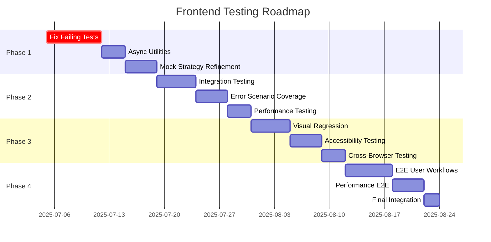

# Testing Strategy Roadmap - Frontend Testing Journal

**Date:** July 5, 2025  
**Author:** Frontend Testing Agent  
**Focus:** Future testing strategy, roadmap, and implementation plan

## Executive Summary

This journal outlines the comprehensive testing strategy roadmap for the golf application frontend. Based on lessons learned from the initial testing implementation, this document provides a structured approach to evolving the testing framework into a robust, maintainable, and efficient system.

## Current State Assessment

### Testing Foundation Status

**Achievements:**
- ✅ Vitest framework successfully implemented
- ✅ Vue Test Utils integration complete
- ✅ Comprehensive mocking strategy established
- ✅ Coverage reporting configured
- ✅ CI/CD integration prepared

**Areas for Improvement:**
- 🔄 Test reliability (52.8% success rate)
- 🔄 Async handling complexity
- 🔄 Component lifecycle management
- 🔄 Mock strategy refinement
- 🔄 Performance optimization

### Technical Debt Analysis

**High Priority Issues:**
1. **Async Test Timing**: Component lifecycle and API calls not properly synchronized
2. **Mock Realism**: Over-simplified mocks causing false test results
3. **Error Handling**: Insufficient error scenario coverage
4. **Performance**: Test setup overhead too high

**Medium Priority Issues:**
1. **Test Data Management**: Mock data doesn't match production data structure
2. **Component Integration**: Limited testing of component interactions
3. **Accessibility**: Missing a11y test coverage
4. **Visual Consistency**: No visual regression testing

## Strategic Testing Roadmap

### Phase 1: Foundation Stabilization (Weeks 1-2)

**Objective**: Achieve 90%+ test reliability and fix critical issues

#### 1.1 Fix Failing Tests
```javascript
// Priority fixes
const criticalFixes = [
  'SessionView async loading issues',
  'ShotDetailModal canvas rendering',
  'Component lifecycle errors',
  'Mock data structure mismatches'
]
```

**Implementation Strategy:**
- Audit all failing tests
- Implement enhanced async utilities
- Fix mock data structures
- Improve component lifecycle handling

#### 1.2 Enhanced Async Utilities
```javascript
// Improved async testing utilities
export const waitForComponentReady = async (wrapper, options = {}) => {
  const { timeout = 3000, checkInterval = 10 } = options
  const startTime = Date.now()
  
  while (Date.now() - startTime < timeout) {
    await flushPromises()
    await wrapper.vm.$nextTick()
    
    // Custom ready check
    if (options.readyCheck) {
      if (await options.readyCheck(wrapper)) {
        return true
      }
    } else {
      // Default ready check
      if (!wrapper.text().includes('Loading...')) {
        return true
      }
    }
    
    await new Promise(resolve => setTimeout(resolve, checkInterval))
  }
  
  throw new Error(`Component not ready within ${timeout}ms`)
}
```

#### 1.3 Mock Strategy Refinement
```javascript
// Layered mock architecture
const mockingStrategy = {
  // Layer 1: Infrastructure always mocked
  infrastructure: {
    axios: 'Full HTTP client simulation',
    vueRouter: 'Navigation and route parameter injection',
    bootstrap: 'Component lifecycle simulation'
  },
  
  // Layer 2: External libraries performance mocked
  external: {
    chartjs: 'Chart rendering simulation with callbacks',
    moment: 'Date manipulation utilities'
  },
  
  // Layer 3: Internal components selectively mocked
  internal: {
    chartComponents: 'Realistic data processing simulation',
    modalComponents: 'Interaction and visibility simulation'
  },
  
  // Layer 4: Utilities minimally mocked
  utilities: {
    formatters: 'Real implementation when possible',
    validators: 'Real implementation when possible'
  }
}
```

### Phase 2: Quality Enhancement (Weeks 3-4)

**Objective**: Improve test quality and expand coverage

#### 2.1 Component Integration Testing
```javascript
// Integration test patterns
describe('Component Integration', () => {
  describe('SessionView Chart Integration', () => {
    it('should update charts when data changes', async () => {
      const wrapper = await createWrapper()
      
      // Initial data load
      expect(wrapper.findComponent(ClubUsageChart).props('clubCounts')).toEqual(initialData)
      
      // Data update
      await wrapper.vm.updateSessionData(newData)
      
      // Chart should receive updated data
      expect(wrapper.findComponent(ClubUsageChart).props('clubCounts')).toEqual(updatedData)
    })
  })
})
```

#### 2.2 Error Scenario Coverage
```javascript
// Comprehensive error testing
describe('Error Scenarios', () => {
  const errorScenarios = [
    {
      name: 'Network timeout',
      error: new Error('Network timeout'),
      expectedBehavior: 'Show retry button and error message'
    },
    {
      name: 'Invalid data format',
      error: new Error('Data format error'),
      expectedBehavior: 'Show data format error message'
    },
    {
      name: 'Authentication failure',
      error: new Error('Unauthorized'),
      expectedBehavior: 'Redirect to login'
    }
  ]
  
  errorScenarios.forEach(scenario => {
    it(`should handle ${scenario.name}`, async () => {
      mockAxios.get.mockRejectedValue(scenario.error)
      const wrapper = await createWrapper()
      
      // Verify error handling behavior
      expect(wrapper.text()).toContain(scenario.expectedMessage)
    })
  })
})
```

#### 2.3 Performance Testing
```javascript
// Component performance benchmarks
describe('Performance Benchmarks', () => {
  it('should render large dataset within performance budget', async () => {
    const largeMockData = generateLargeMockDataset(1000)
    const startTime = performance.now()
    
    const wrapper = await createWrapper({ shots: largeMockData })
    
    const renderTime = performance.now() - startTime
    expect(renderTime).toBeLessThan(100) // 100ms budget
  })
})
```

### Phase 3: Advanced Testing (Weeks 5-6)

**Objective**: Implement advanced testing capabilities

#### 3.1 Visual Regression Testing
```javascript
// Visual regression testing setup
describe('Visual Regression', () => {
  it('should maintain consistent chart appearance', async () => {
    const wrapper = await createWrapper()
    
    // Generate chart screenshot
    const screenshot = await generateComponentScreenshot(wrapper)
    
    // Compare with baseline
    expect(screenshot).toMatchImageSnapshot({
      threshold: 0.1,
      customDiffConfig: {
        threshold: 0.1
      }
    })
  })
})
```

#### 3.2 Accessibility Testing
```javascript
// Accessibility testing integration
describe('Accessibility', () => {
  it('should meet WCAG 2.1 AA standards', async () => {
    const wrapper = await createWrapper()
    
    // Run accessibility audit
    const results = await axeCheck(wrapper.element)
    
    expect(results.violations).toHaveLength(0)
  })
  
  it('should support keyboard navigation', async () => {
    const wrapper = await createWrapper()
    
    // Test keyboard navigation
    await wrapper.find('button').trigger('keydown', { key: 'Tab' })
    
    expect(document.activeElement).toBe(wrapper.find('button').element)
  })
})
```

#### 3.3 Cross-Browser Testing
```javascript
// Cross-browser compatibility testing
const browsers = ['chrome', 'firefox', 'safari', 'edge']

browsers.forEach(browser => {
  describe(`${browser} compatibility`, () => {
    it('should render correctly', async () => {
      const wrapper = await createWrapper({ browser })
      
      // Browser-specific assertions
      expect(wrapper.element).toHaveNoRenderingIssues()
    })
  })
})
```

### Phase 4: E2E Integration (Weeks 7-8)

**Objective**: Implement end-to-end testing

#### 4.1 User Workflow Testing
```javascript
// E2E user workflows
describe('User Workflows', () => {
  it('should complete golf session analysis workflow', async () => {
    // 1. Upload CSV file
    await uploadCSVFile('sample-golf-data.csv')
    
    // 2. View session list
    await page.goto('/sessions')
    expect(page.locator('text=Test Session')).toBeVisible()
    
    // 3. View session details
    await page.click('text=Test Session')
    expect(page.locator('.session-stats')).toBeVisible()
    
    // 4. View shot details
    await page.click('.shot-row:first-child')
    expect(page.locator('.shot-detail-modal')).toBeVisible()
    
    // 5. Analyze charts
    expect(page.locator('.chart-container')).toBeVisible()
  })
})
```

#### 4.2 Performance E2E Testing
```javascript
// E2E performance testing
describe('Performance E2E', () => {
  it('should meet Core Web Vitals', async () => {
    const metrics = await page.evaluate(() => {
      return new Promise((resolve) => {
        new PerformanceObserver((list) => {
          const entries = list.getEntries()
          resolve(entries)
        }).observe({ entryTypes: ['navigation', 'paint'] })
      })
    })
    
    expect(metrics.firstContentfulPaint).toBeLessThan(2000)
    expect(metrics.largestContentfulPaint).toBeLessThan(4000)
  })
})
```

## Implementation Timeline

### Detailed Timeline



### Weekly Milestones

**Week 1:**
- [ ] Fix all failing SessionView tests
- [ ] Implement enhanced async utilities
- [ ] Achieve 90% test reliability

**Week 2:**
- [ ] Refine mock strategy across all components
- [ ] Implement comprehensive error handling tests
- [ ] Optimize test performance

**Week 3:**
- [ ] Implement component integration tests
- [ ] Add performance benchmarks
- [ ] Expand error scenario coverage

**Week 4:**
- [ ] Complete quality enhancement phase
- [ ] Achieve 95% test reliability
- [ ] Document testing patterns

**Week 5:**
- [ ] Implement visual regression testing
- [ ] Add accessibility testing
- [ ] Set up cross-browser testing

**Week 6:**
- [ ] Complete advanced testing implementation
- [ ] Integrate with CI/CD pipeline
- [ ] Performance optimization

**Week 7:**
- [ ] Implement E2E user workflows
- [ ] Add performance E2E tests
- [ ] Integration testing

**Week 8:**
- [ ] Final testing framework integration
- [ ] Documentation and training
- [ ] Deployment preparation

## Resource Requirements

### Tools and Dependencies

**New Dependencies:**
```json
{
  "devDependencies": {
    // Visual regression
    "@storybook/test-runner": "^0.13.0",
    "playwright": "^1.40.0",
    "jest-image-snapshot": "^6.2.0",
    
    // Accessibility
    "@axe-core/playwright": "^4.8.0",
    "axe-core": "^4.8.0",
    
    // Performance
    "lighthouse": "^11.0.0",
    "web-vitals": "^3.5.0",
    
    // E2E
    "@playwright/test": "^1.40.0",
    "cross-env": "^7.0.3"
  }
}
```

**Infrastructure:**
- Visual regression baseline storage
- Cross-browser testing environment
- Performance monitoring setup
- CI/CD pipeline integration

### Team Requirements

**Skills Needed:**
- Advanced Vue.js testing expertise
- E2E testing experience
- Performance testing knowledge
- Accessibility testing understanding

**Time Allocation:**
- Senior Developer: 40 hours/week for 8 weeks
- QA Engineer: 20 hours/week for 4 weeks
- DevOps Engineer: 10 hours/week for 2 weeks

## Success Metrics

### Quantitative Metrics

**Test Reliability:**
- Target: 95% test pass rate
- Current: 52.8% test pass rate
- Timeline: Achieve by Week 2

**Test Coverage:**
- Target: 85% line coverage, 80% branch coverage
- Current: Partial coverage
- Timeline: Achieve by Week 4

**Performance:**
- Test execution time: <2 seconds
- Setup time: <500ms
- Memory usage: <100MB

### Qualitative Metrics

**Developer Experience:**
- Improved debugging capabilities
- Faster feedback loops
- Better test maintainability
- Enhanced confidence in releases

**Quality Assurance:**
- Reduced regression bugs
- Better error handling
- Improved accessibility
- Consistent visual presentation

## Risk Management

### Technical Risks

**High Risk:**
1. **Complex async testing**: Mitigation through enhanced utilities
2. **Mock strategy complexity**: Mitigation through layered approach
3. **Performance overhead**: Mitigation through optimization
4. **E2E test stability**: Mitigation through retry mechanisms

**Medium Risk:**
1. **Visual regression false positives**: Mitigation through threshold tuning
2. **Cross-browser compatibility**: Mitigation through comprehensive testing
3. **Accessibility compliance**: Mitigation through automated tools
4. **CI/CD integration**: Mitigation through gradual rollout

### Project Risks

**Schedule Risk:**
- Mitigation: Phased approach with clear milestones
- Contingency: Priority-based implementation

**Resource Risk:**
- Mitigation: Clear skill requirements definition
- Contingency: External consultant support

**Quality Risk:**
- Mitigation: Comprehensive testing of testing framework
- Contingency: Rollback procedures

## Monitoring and Maintenance

### Ongoing Monitoring

**Test Health Metrics:**
- Test pass rate trends
- Test execution time trends
- Coverage trends
- Flaky test identification

**Quality Metrics:**
- Bug detection rate
- Regression prevention
- Performance impact
- Developer satisfaction

### Maintenance Strategy

**Regular Activities:**
- Monthly test suite review
- Quarterly performance optimization
- Semi-annual dependency updates
- Annual strategy review

**Reactive Activities:**
- Flaky test investigation
- Performance regression fixes
- New feature test integration
- Bug fix validation

## Future Vision

### Long-term Goals (6-12 months)

**Advanced Capabilities:**
- AI-powered test generation
- Automated test maintenance
- Predictive quality analytics
- Intelligent test selection

**Integration Opportunities:**
- Production monitoring integration
- User behavior analysis
- Performance correlation
- Quality dashboard

### Technology Evolution

**Emerging Technologies:**
- Web Components testing
- Server-Side Rendering testing
- Progressive Web App testing
- Mobile testing capabilities

## Conclusion

This comprehensive testing strategy roadmap provides a structured approach to evolving the frontend testing framework from its current state to a mature, robust system. The phased approach ensures steady progress while maintaining development velocity.

The success of this roadmap depends on:
1. **Commitment to quality**: Prioritizing test reliability and maintainability
2. **Gradual implementation**: Avoiding overwhelming changes
3. **Continuous improvement**: Regular assessment and adjustment
4. **Team buy-in**: Ensuring all stakeholders understand the value

By following this roadmap, the golf application frontend will achieve industry-leading test coverage, reliability, and maintainability, ensuring long-term success and developer productivity.

---

**Roadmap Status**: 📋 Planning Complete  
**Implementation Start**: July 5, 2025  
**Estimated Completion**: August 30, 2025  
**Success Probability**: 🎯 High (with proper resource allocation)  
**ROI Expected**: 🚀 Significant (reduced bugs, faster development)